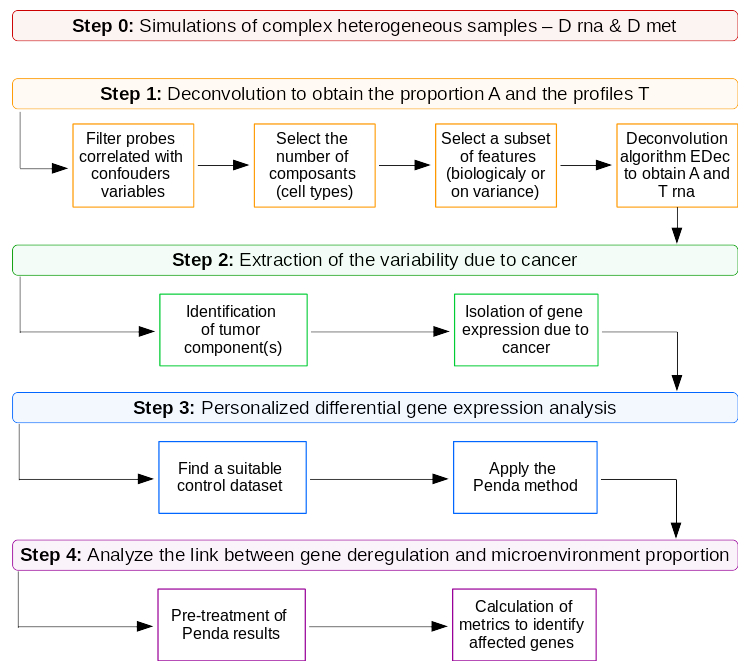

```{r echo=FALSE, eval=TRUE}
knitr::opts_chunk$set(collapse=TRUE, comment = "#>", fig.width=9, fig.height=6, eval=TRUE, echo=TRUE, results="verbatim", dpi=75)
layout(1, respect=TRUE)
```

`RiTMIC` (**R**egulat**I**on of **T**umor **MI**croenvironment **C**omposition) is an open-access R package to study the link between the gene expression in a tumor and the microenvironment composition.  



The pipeline is in 4 steps:  

1. **Deconvolution** of the bulk samples to obtain the cell type composition.
2. **Extraction** of the cancer expression.
3. **Differential** analysis of the gene expression in the cancer component.
4. **Analyze** of the link between the gene expression in the cancer and the tumor composition.

---

This vignette allows to apply the **step 2**, the step of extraction of the variability due to cancer.

# Load data

For this step, we use D_rna, the transcriptome of each bulk samples. We also use the A matrix with the proportion of each cell type in each sample, and the T matrix with the cell type profiles. A and T matrices was obtained with the vignette 1_deconvolution.Rmd.

```{r, label="load_data"}
D_rna = readRDS("data_example/D_rna.rds")
A_calc = readRDS("data_example/res_edec.rds")$A
T_calc = readRDS("data_example/res_edec2.rds")
```

# Identification of cancer cell type

The first part of this step is to identify the cancer cell type. For that, we can use different methods like cell markers, comparison with identified cell lines, etc. Here, as we don't use real cell types, we can assume for example than the cancer cell type is the type 4.

```{r, label="cancer identification"}
pos_tum = 4
```

# Extraction of cancer cell type

Once the cancer type is identified, we can removed of the bulk samples D the signal of the micro-environment (ME). The equation is:  
$D_{cancer} = (D_{RNAseq} - T_{ME} * A_{ME}) / A_{cancer}$

```{r, label="cancer extraction"}
D_cancer = (D_rna - T_calc[, -pos_tum] %*% A_calc[-pos_tum, ]) / rep(A_calc[pos_tum,])
```

# Pretreatment of D cancer

To optimize the next step, we can preatreat D cancer to remove negative expression and samples with too few cancer cells.

```{r, label="Dcancer preatreatment"}
D_cancer_preatreat = Ritmic::pre_treat_Dcancer(D_cancer, A_cancer = A_calc[pos_tum,], prop_cancer_threshold = 0.1)

if(!file.exists("data_example/D_cancer_pretreat.rds")){
  saveRDS(D_cancer_preatreat, file = "data_example/D_cancer_pretreat.rds")
}
```
