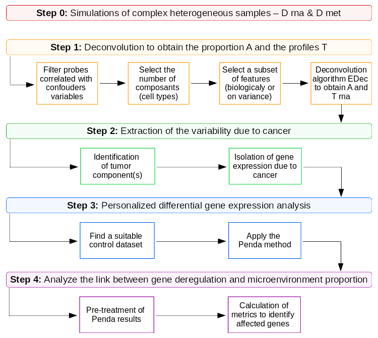

```{r echo=FALSE, eval=TRUE}
knitr::opts_chunk$set(collapse=TRUE, comment = "#>", fig.width=9, fig.height=6, eval=TRUE, echo=TRUE, results="verbatim", dpi=75)
layout(1, respect=TRUE)
```


`RiTMIC` (**R**egulat**I**on of **T**umor **MI**croenvironment **C**omposition) is an open-access R package to study the link between the gene expression in a tumor and the microenvironment composition.  



The pipeline is in 4 steps:  

1. **Deconvolution** of the bulk samples to obtain the cell type composition.
2. **Extraction** of the cancer expression.
3. **Differential** analysis of the gene expression in the cancer component.
4. **Analyze** of the link between the gene expression in the cancer and the tumor composition.

---

This vignette allows to apply the **step 4**, the step of analyse of the link between the gene expression in the cancer and the tumor composition.


# Load data and pretreatment 

`A_calc` is the matrix of cell type proportion, obtained in the vignette 1_deconvolution.Rmd.  
$D_{cancer}$ is the matrix with the gene expression of cancer cells in each sample, obtained in the vignette 2_identification_extraction_tumor_expression.Rmd.  

`res_penda` are the results of the gene expression differential analysis obtained in the vignette 3_penda_analysis.

The function `Ritmic::pre_treat` allows the formatting of the Penda results and sorting to conserve genes with more than `thres_p` samples deregulated and not deregulated.

```{r, label="load_data"}
A_calc = readRDS("tmp_ritmic/res_edec.rds")$A
D_cancer = readRDS("tmp_ritmic/D_cancer.rds")
res_penda = readRDS("tmp_ritmic/penda_res.rds")
genes_dereg = readRDS("tmp_ritmic/T_tum_dereg.rds")$g_dereg

res_penda_f = Ritmic::pre_treat(penda_res = res_penda, thres_p = 5)
```

# Compute metrics on penda and on gene expression

For each gene, the function `calc_dist` makes two groups according to the deregulation status. Then, it computes for each cell type different metrics to evaluate the distance between the two groups of cell proportions. An important distance suggests a link between the gene expression and the cell type proportion.  

The function `calc_corr` compute the correlation between the gene expression in bulk samples and the micro-environment proportion.  

```{r, label="compute metrics "}
res_dereg <- Ritmic::calc_dist(binary_penda = res_penda_f, A = A_calc)
res_corr <- Ritmic::calc_corr(D_cancer = D_cancer, A = A_calc)
```

# ROC curve

Find where is the ME cell type in the calc matrices

```{r, label="ME identification"}
A_ref = readRDS("tmp_ritmic/A_matrix.rds")
rownames(A_ref) = c("", "", "immune","")
cor(t(A_ref), t(A_calc))
pos_ME = which.max(cor(t(A_ref), t(A_calc))[3,])
```

**To do** : describe this step

```{r,label="RiTMIC::plot_res"}
#To focus on the cell type 3 
corr_ME = res_corr[res_corr$type == pos_ME, ]
dist_ME = res_dereg[res_dereg$type == pos_ME, ]

pvalues = c(0, 0.00005, 0.0001, 0.0005, 0.001, 0.0025, 0.005, 0.0075, 0.01, 0.02, 0.03, 0.04, 0.05, 0.1, 0.15, 0.2, 0.25,  0.3, 0.35, 0.4, 0.45, 0.5, 0.55, 0.6, 0.65, 0.7, 0.75, 0.8, 0.85, 0.9, 0.95, 1)

Ritmic::plot_res(corr_res = corr_ME, dist_res = dist_ME, genes_dereg = genes_dereg, pvalues, graph_title = "ROC curves to test the model improvement induce by PenDA")
```

# Informations

If curves of distance methods have a higher True Positive Rate (TPR) combined a lower False Positive Rate(FPR) than correlation curve, __PenDA__ improves the model.  

# Session Information

```{r, results="verbatim"}
sessionInfo()
```
